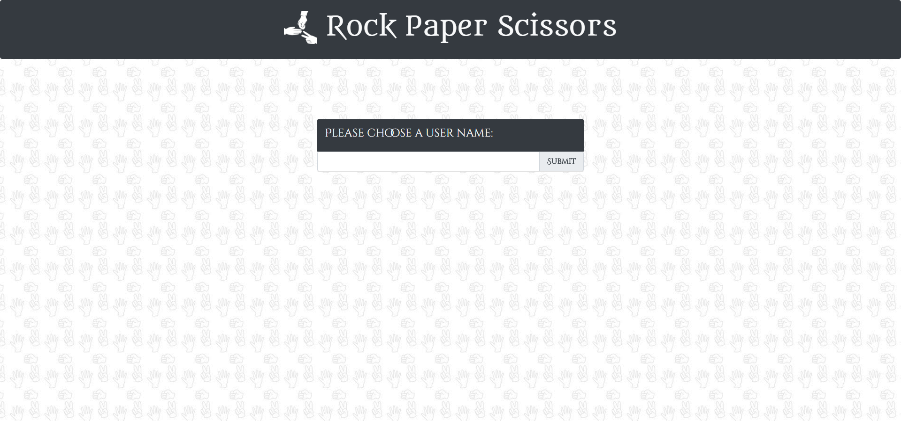
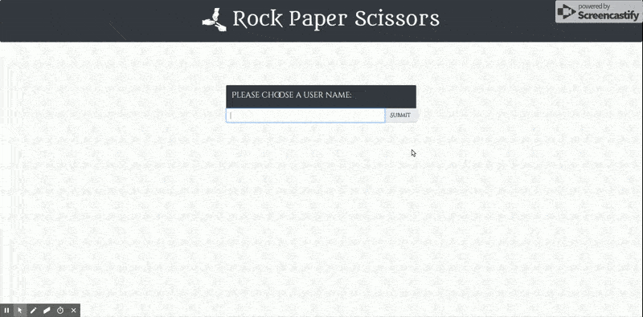

# Rock-Paper-Scissors
Play Rock, Paper, Scissors with other people! Enjoy chatting with your opponent as you match wits in this classic game.

## Getting Started

Open up the [project link](https://robertshaw87.github.io/Rock-Paper-Scissors/) and you should be able to see the example webpage shown below:

Enter your preferred user name and join others in the timeless game of Rock Paper Scissors. Once you're at the head of the queue, you'll gain access to the chat and face off against another player! See how many wins you can achieve and how many players you can defeat.

### Prerequisites

You need to have a modern browser able to handle html5, javascript, and css. 

### Installing

No installation needed! Just open the page in your preferred browser.

## Built With

* Html

* CSS

* [Javascript](https://www.javascript.com/) - The scripting language used

* [BootstrapCDN v4.1.0](https://getbootstrap.com/docs/4.1/getting-started/introduction/) - The web framework used

* [jQuery v3.3.1](http://jquery.com/) - Java library for DOM and CSS manipulation

* [Google Firebase 4.13.0](https://firebase.google.com/) - Online database

* [Google Fonts](https://fonts.google.com/) - Font repository

## Authors

* **Robert Shaw** - *Initial work* - [robertshaw87](https://github.com/robertshaw87)