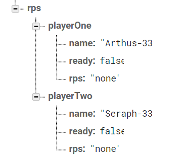
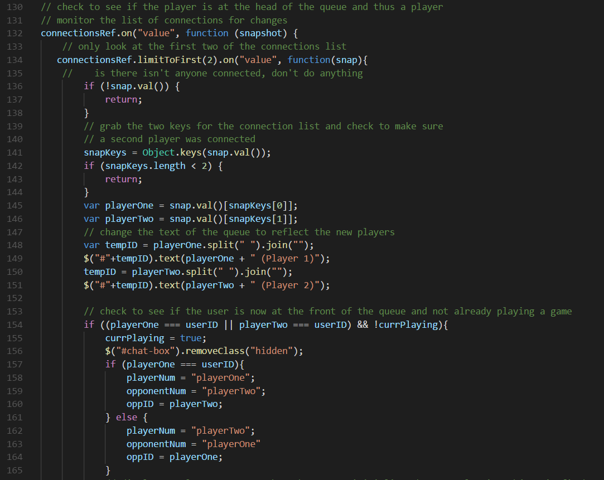

# Rock-Paper-Scissors
Play Rock, Paper, Scissors with other people! Enjoy chatting with your opponent as you match wits in this classic game.

## Getting Started

Open up the [project link](https://robertshaw87.github.io/Rock-Paper-Scissors/) and you should be able to see the example webpage shown below:

Enter your preferred user name and join others in the timeless game of Rock Paper Scissors. Once you're at the head of the queue, you'll gain access to the chat and face off against another player! See how many wins you can achieve and how many players you can defeat.

### Prerequisites

You need to have a modern browser able to handle html5, javascript, and css. 

### Installing

No installation needed! Just open the page in your preferred browser.

## Built With

* Html

* CSS

* [Javascript](https://www.javascript.com/) - The scripting language used

* [BootstrapCDN v4.1.0](https://getbootstrap.com/docs/4.1/getting-started/introduction/) - The web framework used

* [jQuery v3.3.1](http://jquery.com/) - Java library for DOM and CSS manipulation

* [Google Firebase 4.13.0](https://firebase.google.com/) - Online database

* [Google Fonts](https://fonts.google.com/) - Font repository

## Challenges

This was my first time working extensively with Firebase, so I had some issues with the logic flow neccesary to make my app do everything I wanted it to do. Thankfully, I managed to work through it by leaning heavily on the documentation and other online resources. This was a great challenge!

In order to handle the asynchronous nature of two different people playing, I ended up using a ready token to indicate whether a player has chosen a play. I listened for changes to the ready state of both players and when they had each selected a play, then I went into the logic behind the wins and losses.

I created a list of connected players to track the queue. Each time a new player enters or leaves, I have the players check to see if someone needs to moved up into the game room. If one of the players leave, the remaining player evaluates the queue and populates the game room with him or herself and the first person in the queue. In the case of there not being anyone in the queue (and thus no players in the game room running the queue logic) the first person to enter the queue automatically gets placed in the game room.

## Authors

* **Robert Shaw** - *Initial work* - [robertshaw87](https://github.com/robertshaw87)
